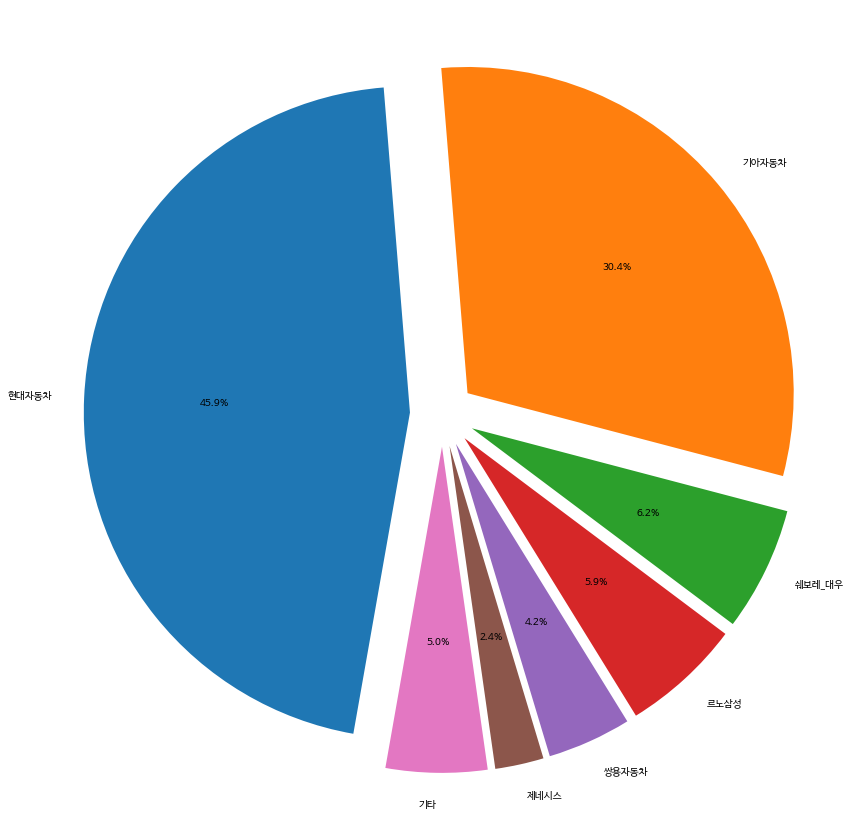
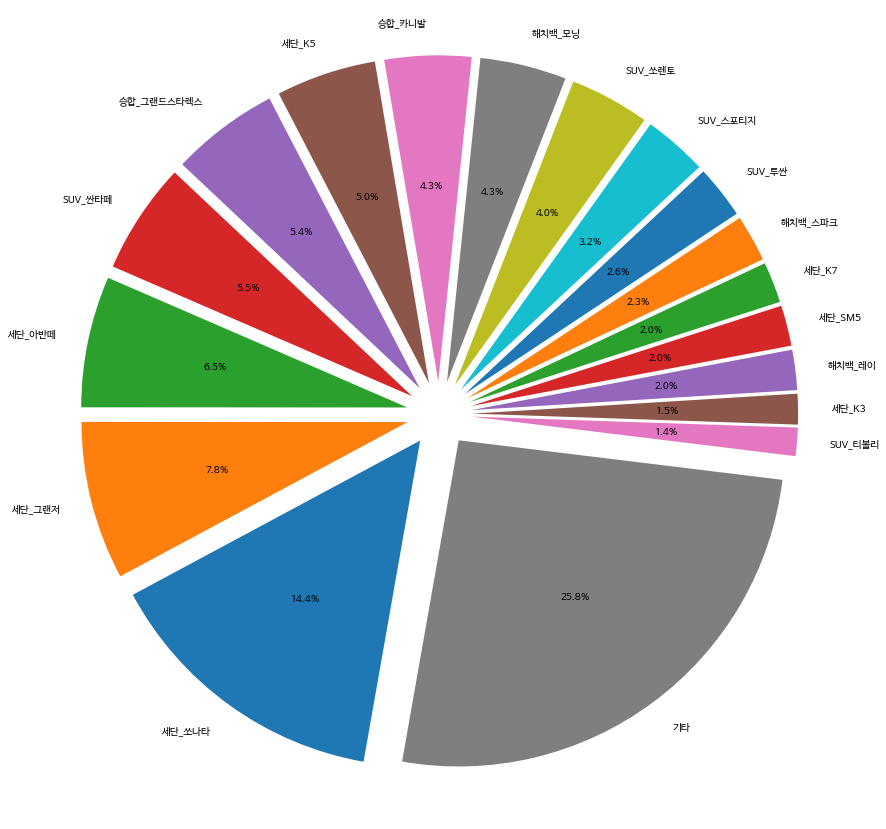
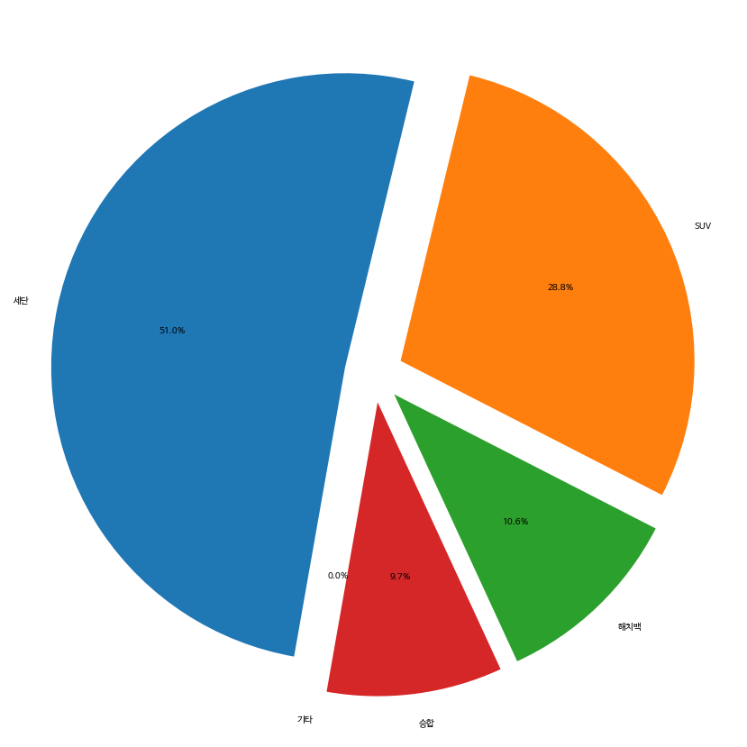
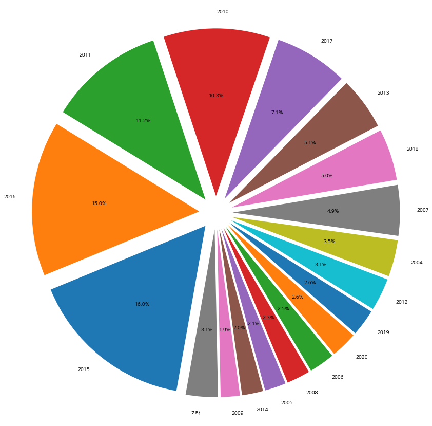
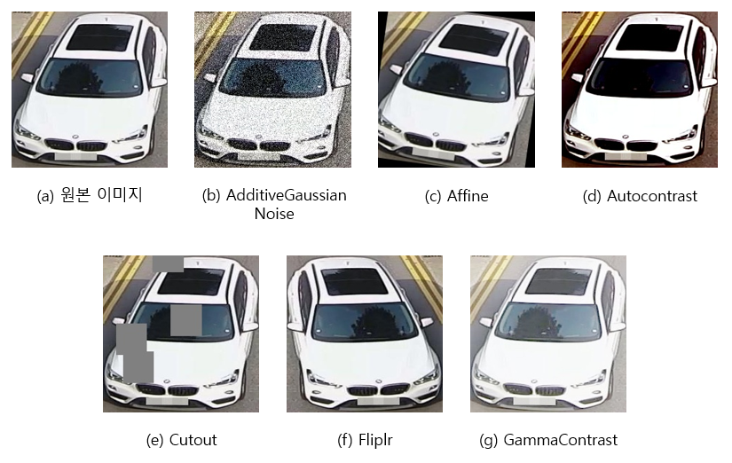
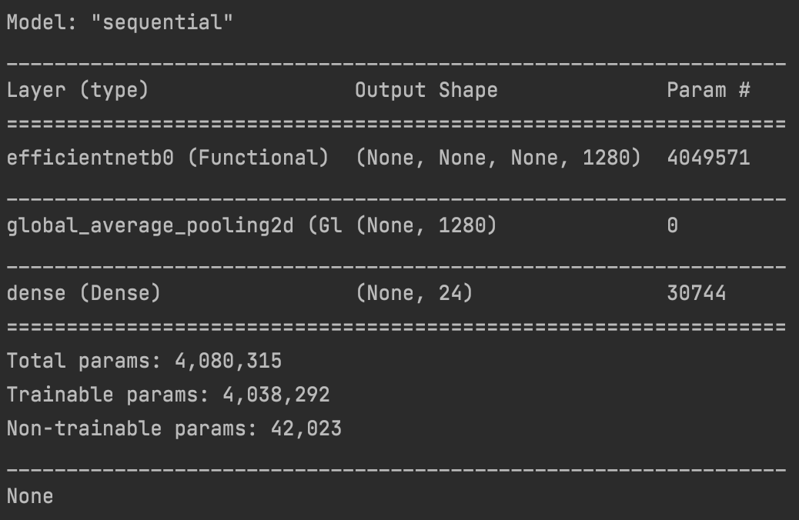
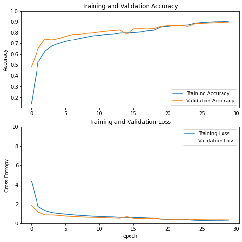

# NEXTLab Car Detection Project

### Example
[](https://colab.research.google.com/drive/1kumrFpGtc3K2hfOW8VRj4-AfuQFV4HIR?usp=sharing)

## Main Contributers
- Jeongtae Shin(<a href="https://github.com/Klassikcat">@Klassikcat</a>): Project Management, Model build, Engineering
- Jaewoong Lee(<a href="https://github.com/colin19950703">@colin19950703</a>): Augmentation, model build, Enigeering
- Hongkyun Kim(<a href="https://github.com/ghdrbs0302">@ghdrbs0302</a>): Data Inspection, Test data Labeling, Engineering

## Installation
````shell
!pip install -U git+https://github.com/Klassikcat/project-NEXTLab-CNN-EfficientNet
````

## Structure
````Python
project-NEXTLab
┖ core
  ┖ config.py               # Tensorflow Configuration
  ┖ utils.py
┖ model
  ┖ EfficientNet.py         # Model block and builder
  ┖ initializers.py         # from EfficientNetv2 (https://arxiv.org/abs/2104.00298)
  ┖ layer.py                # from EfficietnNetv2
  ┖ model.py                # from EfficientNetv2
  ┖ params.py               # from EfficientNetv2
┖ utils
  ┖ augmentation            # Data augmentation tools
    ┖ augmentation.py
    ┖ launcher_augment.py
    ┖ launcher_classname.py
  ┖ from_folder             
    ┖ loader.py             # get train/valid/test dataset from directory
  ┖ tfrecord                 
    ┖ tfrecordMaker         # Make TFRecord
    ┖ tfrecordViewer        # Visualize, Load TFRecord 
  ┖ unicodeUtil.py          # Korean utilities assemble jamo
  ┖ visuialization.py       # Plots(data distribution, heatmap)
setup.py                    # installer
readme.md
````

## Objective
- Making EfficientNetv2 application that distinguish 322 cars by using photos captured by traffic camera
- Traffic enforcement, Parking lot management.

## Data
### Train/Validatation Data
- Uses modified "자동차 차종/연식/번호판 인식용 영상" from AIHub: <a href="https://aihub.or.kr/aidata/27727"> https://aihub.or.kr/aidata/27727 </a>
- Uses 522 classes in "세단", "SUB", "해치백", "승합"

### Test Data
- Road Camera dataset from NEXTLab: https://www.nextlab.ai/
- 5016 images belonging to 80 classes

### Data Distribution


approximately 82% of data is korean cars(hyundai, KIA)



approximately 75% of data is korean cars(sonata, etc...)



51% sedan, 28.8% SUV, 10% Hatchback, 9% van



mainly consists with 2010~2018 cars

### Data Augmentation



- use these augmentations taking the possible road situations into account.
- Drop the class with less than 30 pieces of data in order to avoid data leakage
- randomly pick 300 data. if the class has less than 30 data, proceed Data Augmentation for equal distribution of data

## Model Structure
</a>
- EfficientNetB0(224, 224) with 30 layer freeze

## Train_validation accuracy/loss

### top 1 accuracy/loss
- train: 0.9051/0.2755 
- valid: 0.8960/0.3769

### top 3 accuracy
- train: 0.9880
- valid: 0.9717



## Further Work
[ ] Increase valid/test accuracy by making Ensemble model

[ ] Label Smoothing

[ ] Fix all false label
