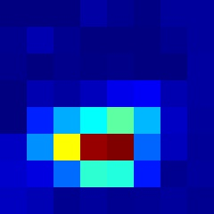
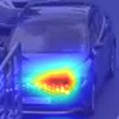
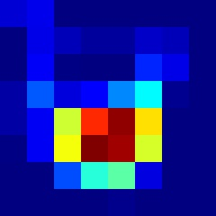
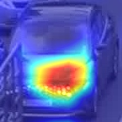

# NEXTLab Car Detection Project

### Example

## Main Contributers
- Jeongtae Shin(<a href="https://github.com/Klassikcat">@Klassikcat</a>): Project Management, Model build, Engineering
- Jaewoong Lee(<a href="https://github.com/colin19950703">@colin19950703</a>): Augmentation, model build, Enigeering
- HongGwun Kim(<a href="https://github.com/ghdrbs0302">@ghdrbs0302</a>): Data Inspection, Test data Labeling, Engineering

## Data
### Train/Validatation Data
- Uses modified "자동차 차종/연식/번호판 인식용 영상" from AIHub: <a href="https://aihub.or.kr/aidata/27727"> https://aihub.or.kr/aidata/27727 </a>
- Only uses 322 classes in "세단", "SUB", "해치백", "승합"
- deliberately select 300 images accroding to the image  

## Model Structure
</a>
- EfficientNetB0(224, 224) with 30 layer freeze

## Train_validation accuracy/loss

### top 1 accuracy/loss
- train: 0.9051/0.2755 
- valid: 0.8960/0.3769

### top 3 accuracy
- train: 0.9880
- valid: 0.9717

## Visualization Example

### Data distribution

### Heatmap

